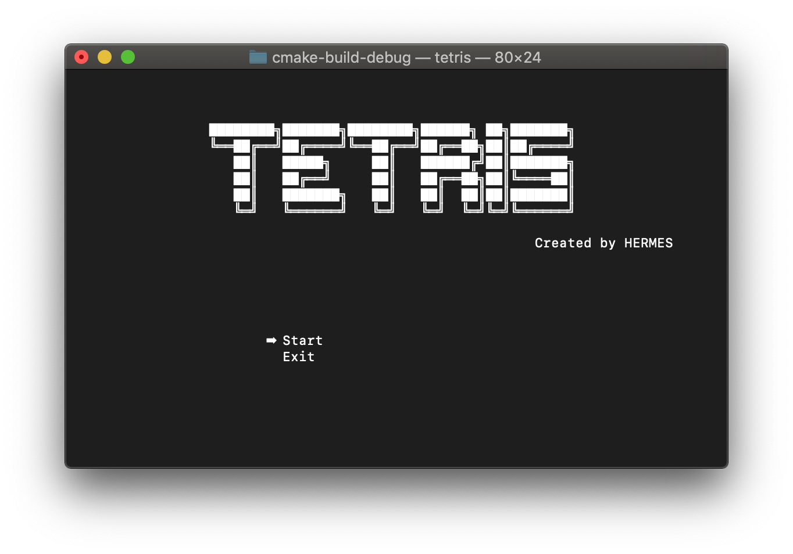

# Console GameStage
This is classic `Console GameStage`. It is made by C++ with ncurses library on MacOS.

## Environment 
    1. OS : macOS, Mojava, 10.14.4
    2. C++ Version : C++11
    3. IDE : CLion 2018.03
    4. Build : cmake

## Start
#### 1. fist install ncurses.

    brew install ncurses
    
#### 2. git clone 

    git clone https://github.com/hermes7308/tetris.git
    

